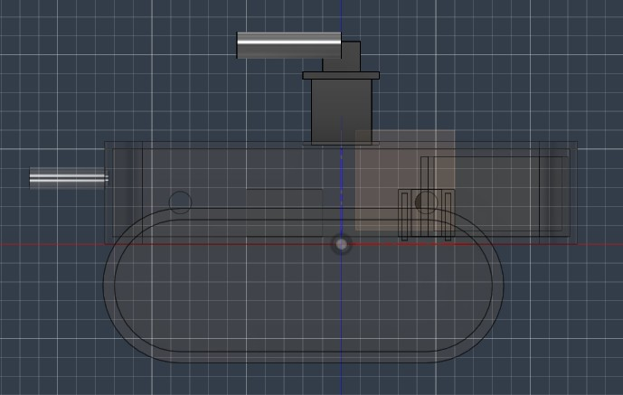

# Joshua Oluku
### Mechatronics Engineering Student | University of Nigeria, Nsukka
[LinkedIn](https://www.linkedin.com/in/joshua-oluku-348ba1294/) | [GitHub](https://github.com/JoshuaOluku)

---

## 🛠️ Technical Profile
Fourth-year Mechatronics Engineering student at UNN. Focused on parametric 3D design, hardware-in-the-loop simulation, and embedding firmware logic onto edge microcontrollers. Experienced in identifying manufacturing constraints (DFM), optimizing mechanical assemblies, and writing data-driven scripts for automated computer vision systems.

---

## 🚀 Engineering Projects

### 🚒 1. Autonomous Tracked Firefighter Robot
An indoor response vehicle developed to navigate structural fire scenes, bypass debris, and target localized hazards using a dual-axis spray gimbal.

#### 📐 System Assembly & Manufacturing Architecture

#### ⚙️ Engineering Decisions & Design Iterations:

* **Drivetrain Constraints:** Swapped traditional wheels for a $250\text{mm} \times 180\text{mm} \times 50\text{mm}$ continuous track (tank tread) configuration. Tracks distribute the vehicle’s $2.7\text{kg}$ operational weight over a wider surface area, providing the necessary ground traction to clear door thresholds and indoor debris without slipping.
* **Modular Fluid Containment (DFM Partitioning):** The initial design used an integrated internal baffle wall to create a rear reservoir. Realizing that printing a monolithic fluid chamber causes severe structural warping and leaves FDM layer lines porous to leaks, I modified the design. I removed the built-in wall and created a separate **Modular Drop-In Water Tank** ($171\text{mm} \times 74\text{mm} \times 42\text{mm}$) with a $0.5\text{mm}$ clearance tolerance to allow for 3D printer material expansion. Vertical guide ribs were added to lock the tank horizontally while keeping it easy to remove for maintenance.
* **Friction Isolation via Bearing Seats:** To prevent rotating steel axle shafts from wearing down and melting raw 3D-printed plastic walls, I cut concentric $\varnothing16\text{mm} \times 2\text{mm}$ deep counterbores into the outside of the $\varnothing12\text{mm}$ axle holes. This design change allows flanged ball bearings to press-fit flush into the frame, isolating rotational friction completely.
* **Targeting Stability:** Designed a top-deck recessed mounting slot to anchor a dual-servo pan-tilt gimbal tower. The water delivery tube terminates at a custom **venturi mist nozzle** aligned perfectly with the robot’s $Y=0\text{mm}$ centerline, neutralizing asymmetric fluid recoil during active pump discharging.

#### 🧠 Control Loop Architecture & Calibration
* **Embedded Logic:** Developed and verified the tracking firmware inside an emulated hardware loop using an **Arduino Uno** architecture. The C++ control loop continually reads inputs from three separate spatial vectors (`SENSOR_LEFT`, `SENSOR_CENTER`, `SENSOR_RIGHT`) using a custom NTC thermistor voltage divider matrix. Once local thermal radiation exceeds a calibrated ADC threshold (>750), the firmware overrides standard navigation parameters, stabilizes the top-deck nozzle servo gimbal, and switches a digital pin to drive a high-pressure pump relay for localized fire suppression.
* **Tools:** `Autodesk Fusion` `Tinkercad Circuits` `C++ (Arduino IDE)` `Thermal Calibration Matrix`

---

### 🛸 2. AeroMed Heavy-Lift UAV
An autonomous heavy-lift medical drone designed to transport $2\text{--}3\text{kg}$ supplies over urban traffic obstacles.

#### 📐 Hexacopter Structural Airframe Configuration

#### 🧠 Real-Time Vision Tracking Loop

* **Structural Optimization:** Designed a dual-plate regular hexagonal frame with a 240mm footprint using 3mm carbon fiber plates. Cut out weight-reduction pockets to reduce chassis plate mass by 20% while maintaining required bending stiffness. Distributed 6× hollow carbon fiber arms (20mm OD) at 60° angles to balance structural stress.
* **Computer Vision Target Tracking:** Wrote an automated script inside Google Colab using OpenCV to compile a synthetic dataset. Trained a lightweight **YOLOv8 Nano** model at $320\times320$ resolution for real-time edge processing. Integrated a proportional tracking control script that translates target pixel errors into directional velocity vectors via **PyMAVLink** to command a Pixhawk autopilot during autonomous landings.
* **Tools:** `Autodesk Fusion` `YOLOv8` `OpenCV` `Python` `PyMAVLink`

---

## 🛠️ Technical Competencies

* **Mechanical Engineering:** Parametric 3D Assembly Modeling, Design for Manufacturing (DFM), Fits & Tolerances, Structural Weight Optimization, Fusion 360, SolidWorks.
* **Control Systems & Software:** Embedded System Programming, Hardware-in-the-Loop Simulation, Multi-core Microcontrollers (ESP32), Real-Time Object Detection (YOLO), Computer Vision pipelines.
* **Operations:** Technical Documentation, System Integration, UNN Mechatronics Club Administration (General Secretary).

---

## 👔 Leadership & Milestones

### **General Secretary** — Mechatronics Club, University of Nigeria, Nsukka
*June 2025 — Present*
* Direct daily administrative tasks, manage official correspondence, and coordinate core team deliverables for the engineering club student body.
* Organized and executed the 2-day national career webinar *"Navigating Internships, Career Growth & Life After School"*, supervising speaker onboarding and cross-department promotional strategies.
* Negotiated brand placement terms with corporate tech sponsors to fund student engineering activities.
